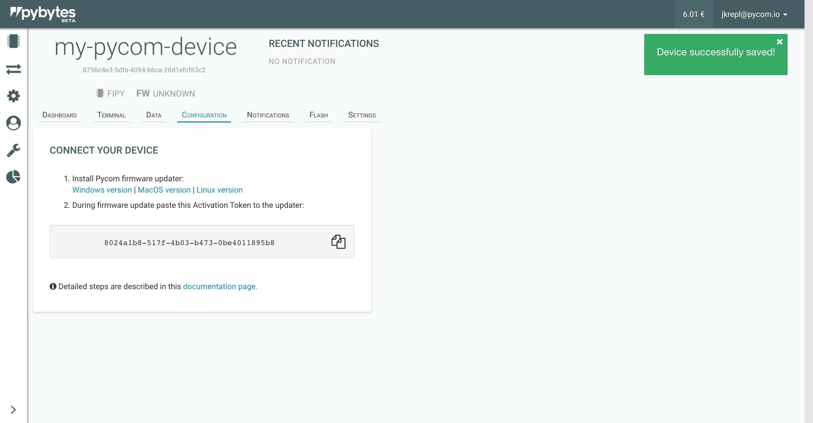

# Connect device to Pybytes

In this section, we explain to you how to connect your device to Pybytes quickly using the Firmware Updater tool.

### Step 1: Download the firmware updater

At the last step of the "Add Device" process:

1. Select Firmware updater for your operating.

    (Firmware updater is also available in [Downloads](https://pycom.io/downloads/) section on pycom.io)

2. Copy the activation token.

    The activation token is valid for one hour. If your activation token is expired, you can create a new one.

### Step 2: Firmware updater

Install the Firmware updater on your computer.

1. Start the *Firmware updater*;

2. Select your device serial port \(Make sure your device is connected to your computer\);

3. Mark the options "Erase flash file system" and "Force update Pybytes registration";

4. Paste your activation token from Pybytes;

5. The firmware updater will update the device's firmware.

## Next step: Set up your device's dashboard!

[Now it's time to display data from your device into Pybytes dashboard](../dashboard.md)



